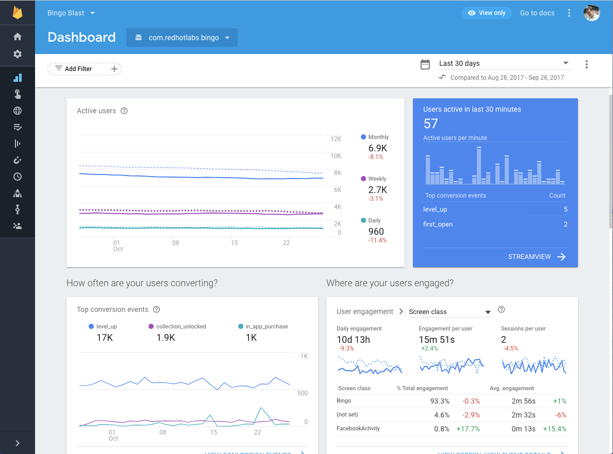

Logging is an essential component of our research, allowing us to track user interactions and system events in a structured manner. Our goal is to keep logs as simple and lightweight as possible while capturing the necessary details to analyze user behavior and system performance effectively.

Each log entry will consist of the following core attributes:

- **Action** – The specific user interaction or system event (e.g., `"clicked_accordion"`).
- **Content** – Contextual information about the action (e.g., `"FAQ Section – Payment Options"`).
- **Timestamp** – The precise time when the action occurred.

Our Firebase log entries will look like this in Firestore:

```json

"action": "Clicked_Accordion",
"content": "Visual Heigharchy",
"timestamp": "2025-02-20T14:30:45Z"

"action": "Clicked_Chat_Suggestion",
"content": "ChatGPT generated response #1: 'Why is this important?'",
"timestamp": "2025-02-20T14:30:45Z"

```

## Viewing the Data
By using firebase console, we are then able to see all the data that we've collected throughout the experiment, with the option to query or export our logs for further analysis. 
<br></br>
Example :
