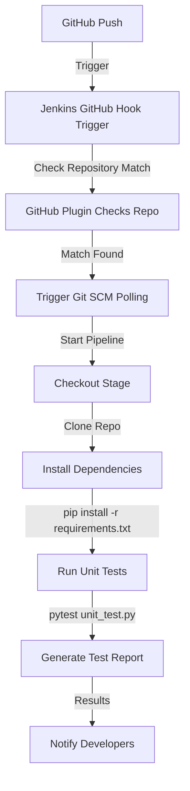

# Acceptance test for Feedstack

## Introduction
Acceptence testing in Feedstack assesses the project for all functional & nonfunctional requirements. Using a production-like environment, all system components are evaluated in a **Continual Integration** pipeline. Powered by *Docker* and *Jenkins*, automation of the execution of acceptance-testing provides insighht into real-time application behavior to reliably deliver updates.

---

## **Continual Integration(CI)**
**Purpose:** 
The **GitHub hook trigger for GITScm polling** in Jenkins listens for push events from GitHub, ensuring that the pipeline automatically runs as soon as a change is pushed to the repository, keeping the integration process seamless and continuous.

### Implementation:
When Jenkins receives a GitHub push hook, GitHub Plugin checks to see whether the hook came from a GitHub repository which matches the Git repository defined in SCM/Git section of this job. If they match and this option is enabled, GitHub Plugin triggers a one-time polling on GITScm.



---

### Groovy Pipeline Script 

```groovy
pipeline {
    agent any
    stages {
        stage('Checkout') {
            steps {
                // Clone the GitHub repository
                git branch: 'JonWorking', url: 'https://github.com/Capstone-Projects-2025-Spring/project-feedstack.git'
            }
        }
        
        stage('Install Dependencies') {
            steps {
                dir('Feedstack') {
                    sh 'pip install -r requirements.txt' // Install dependencies
                }
            }
        }

        stage('Run Unit Tests') {
            steps {
                dir('Feedstack') {
                    sh 'pytest unit_test.py --junitxml=test-results.xml' //python testing
                }
            }
        }
    }
}
```
